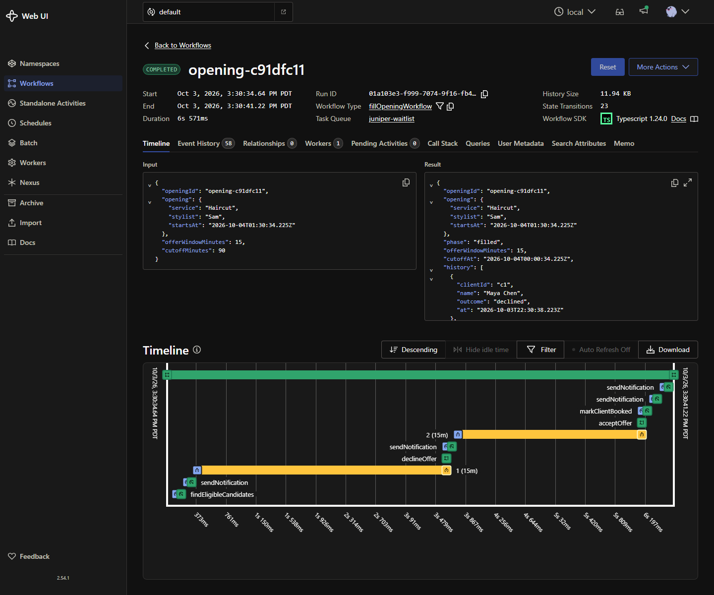

# Evidence

[`temporal-workflow.png`](temporal-workflow.png) shows one representative Workflow in the Temporal Web UI:

- **Workflow ID:** `opening-c91dfc11` (type `fillOpeningWorkflow`, task queue `juniper-waitlist`)
- **Status:** Completed. The opening was filled.
- **Event history (timeline):**
  1. `findEligibleCandidates` Activity loads matching waitlist clients
  2. `sendNotification` texts the first client (simulated), and a 15-minute offer timer starts
  3. `declineOffer` Update: the first client declines, so the timer is cancelled and the offer moves on
  4. `sendNotification` texts the next client, and a new 15-minute timer starts
  5. `acceptOffer` Update: the second client accepts and the opening locks
  6. `markClientBooked` and two `sendNotification` Activities confirm the booking to the client and the front desk

All names and phone numbers are sample data. No real personal information is shown.
